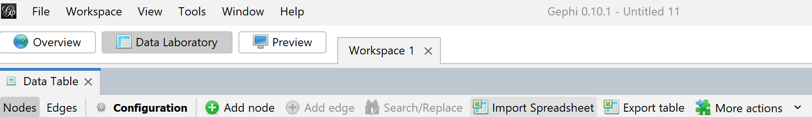
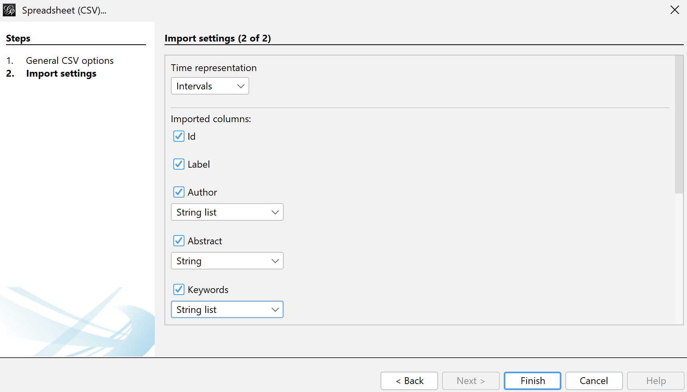
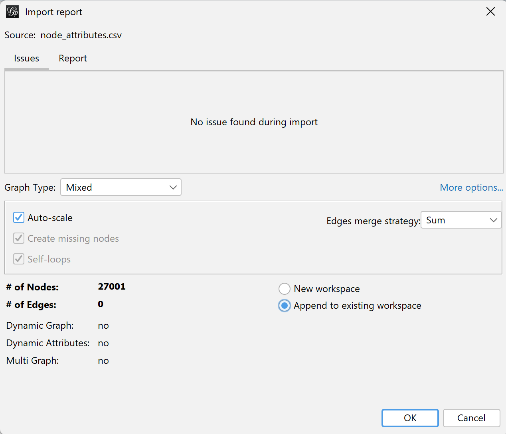
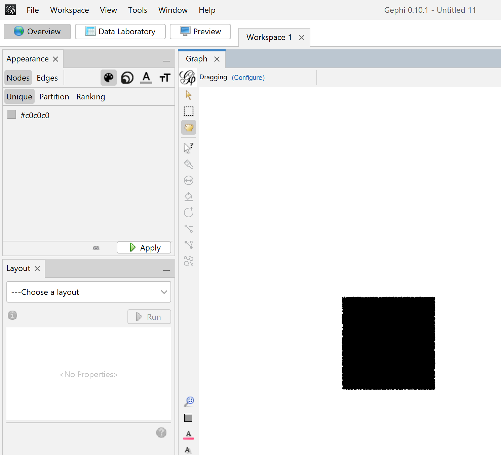
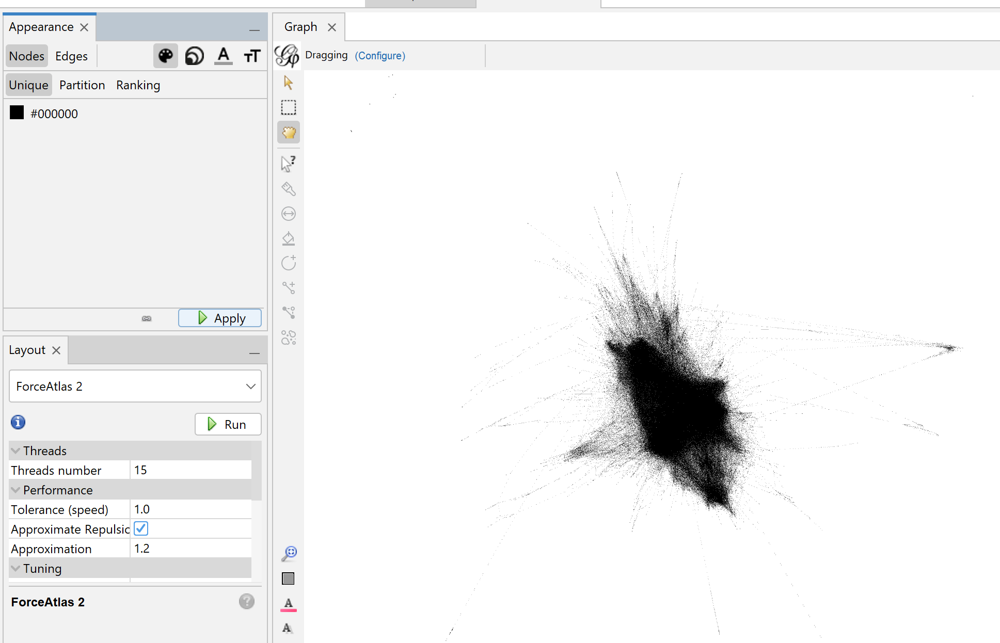
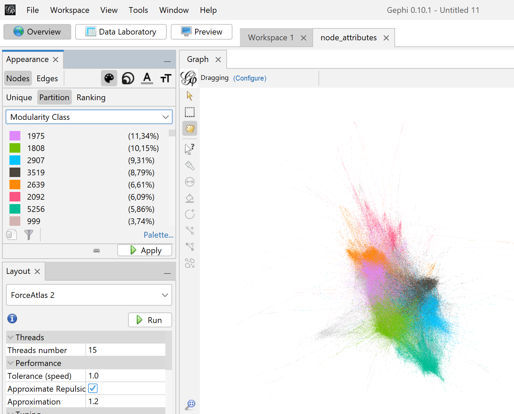

# Replicate results
These scripts allow to replicate the methodology for reproducing the graph. To reproduce it with the whole dataset, copy the scripts to the *full_example*, scripts, and run them in order.

We recommend to first reproduce the steps with the toy example, which uses a subset of 10 publications each from the databases, for a total of 40 publications, as a proof of concept to test the methodology. As before, just copy the scripts to the *toy_example* directory.

The scripts can be run as regular Python scripts. If desired, they can be run as Jupyter notebooks when using Visual Studio Code, as described [here](https://code.visualstudio.com/docs/python/jupyter-support-py).

The data retrieval can be a long and difficult process, so it is recommended to start from **Step 2.**

# Installing the requirements
Pixi, conda, venv, and pip are supported for easyli installing the required packages. Pixi is recommended.

## Pixi
```console
pixi install
```

## Conda
```console
conda create -n my_env_name
conda activate my_env_name
conda install --yes --file requirements.txt 
```

## Pip
*Warning:* this will install the packages globally  
```console
pip install -r requirements.txt
```

# Script order
## 1. retrieve_data
Obtain data from databases.
- **Input**: None.
- **Output**: EBSCO_DB.ris, scopus_DB.csv, pubmed_DB.json, Web_of_science_DB.csv
## 2. combine_asu_wos_pubmed
Combine EBSCO's ASU, PubMed and Web of science  databases into a single one.
- **Input**:EBSCO_DB.ris, Web_of_science_DB.csv, pubmed_DB.json
- **Output**: pubmed_EBSCON_WoS_DB.csv
## 3. add_scopus_and_fix_authors.py
Add scopus and fix authors column.
- **Input**:pubmed_EBSCON_WoS_DB.csv, scopus_DB.csv
- **Output**: db_v1.csv
## 4. delete_duplicates
Delete duplicates,
- **Input**: db_v1.csv
- **Output**: db_v2.csv
## 5. getCitationReferences
Obtain citations and references from SemanticScholar.
- **Input**: db_v2.csv
- **Output**: citations.csv, failed_fetches.csv, references.csv
## 6. makeCitationMatrix
Create citation matrix and the nodes and edges to be imported to gephi.
- **Input**: db_v2.csv, citations.csv, references.csv
- **Output**: edge_attributes.csv, node_attributes.csv, citation_matrix.csv
## 7. Import to gephi
### 7.1 Import CSVs
- **Input**: node_attribtues.csv, edge_attributes.csv
- **Output**: graph.gephi, graph.gefx

Go to the *Data Laboratory* tab, then click on *Import Spreadsheet*.



Import *6.Data/node_attributes.csv*. Click *Next*, then when selectyng the data type for each column, accept the defaults except for *Author* and *Keywords*; change those to *String List*. 


Click *Finish*, and make sure there is no errors. Select the option *Add data to current workspace* and press *Ok*.


*If there is an error, most probably there is a quote in the database that was not correctly escaped at the line where the error happened.*

Afterwards, the same way as before, import *6.Data/edge_attributes.csv*. Click Next, then *Append to existing workspace*.

### 7.2 Create visualization
Go to Overview. You should see something like the following:



Then, go to *Layout*, and choose *ForceAtlas2*. Click *Run* with the default parameters, and wait until the graph visually converges.



Next, in *Statistics*, go to *Modularity* in the *Community Detection* subsection, and click *Run*. 


Close the *Modularity Report*. Then, go to *Appearance* > *Nodes* > *Partition*, select *Modularity Class* from the drop-down menu, and click *Apply*.



Finally, you can go to *File* > *Save as..* to save as a .gephi project, and you can also go to *File* > *Export* to save it as .gefx.